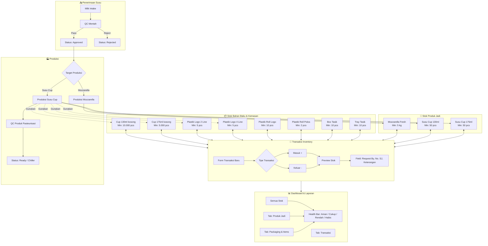

# RSI OS — Flowchart Inventory & Produksi

## Alur Proses

| Langkah | Proses | Catatan |
|---------|--------|---------|
| 1 | Susu mentah masuk → QC Mentah | Di QC, pilih tipe "Mentah" |
| 2 | Jika lolos QC → siap produksi | Status batch jadi "approved" |
| 3 | Produksi Susu Cup → butuh stok cup kosong & plastik | Stok kemasan otomatis terpakai |
| 4 | QC Produk (pasteurisasi) | Di QC, pilih tipe "Pasteurisasi" |
| 5 | Produk jadi masuk inventory | Transaksi IN untuk Susu Cup |
| 6 | Stok packaging & items bisa ditambah/dikurang manual | Via form transaksi inventory |

## Cara Baca Health Bar

| Health | Rentang Stok | Warna |
|--------|-------------|-------|
| **Aman** | Stok > Min × 2 | Hijau |
| **Cukup** | Min < Stok ≤ Min × 2 | Kuning |
| **Rendah** | 0 < Stok ≤ Min | Merah |
| **Habis** | Stok ≤ 0 | Abu-abu |

## Item Default (Seeder)

| Kode | Nama | Kategori | Min Stok |
|------|------|----------|----------|
| MOZZA-001 | Mozzarella Fresh | mozzarella | 5 kg |
| CUP130-001 | Susu Cup 130ml | susu_cup | 50 pcs |
| CUP175-001 | Susu Cup 175ml | susu_cup | 50 pcs |
| PKG-CUP130 | Cup 130ml (kosong) | packaging | 10.000 pcs |
| PKG-CUP175 | Cup 175ml (kosong) | packaging | 5.000 pcs |
| PLG-2L | Plastik Logo 2 Line | packaging | 5 pcs |
| PLG-4L | Plastik Logo 4 Line | packaging | 5 pcs |
| PLG-RL | Plastik Roll Logo | packaging | 10 pcs |
| PLG-RP | Plastik Roll Polos | packaging | 2 pcs |
| BOX-01 | Box Tasik | packaging | 10 pcs |
| TRAY-01 | Tray Tasik | packaging | 10 pcs |
